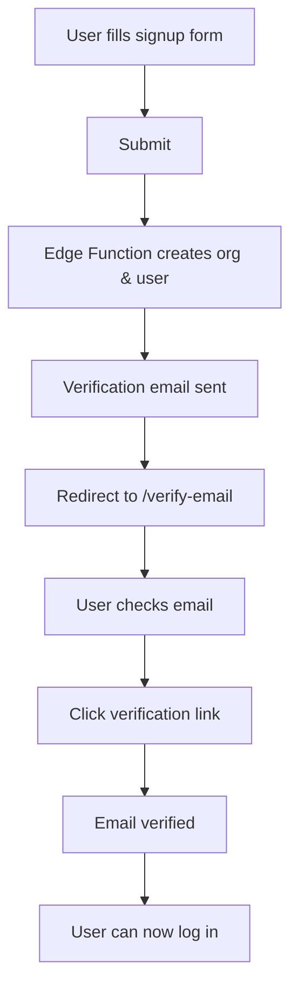

# Email Verification Implementation

## Overview
This document describes the email verification system implemented for organization signup to enhance security and prevent spam accounts.

---

## What Was Changed

### 1. **Edge Function: create-organization-signup**
**File:** `supabase/functions/create-organization-signup/index.ts`

#### Changes:
- **Line 167**: Changed `email_confirm: true` → `email_confirm: false`
  - Users now **must verify** their email before they can log in
  - Industry standard practice for account security

- **Lines 297-396**: Replaced welcome email with verification email
  - Uses Supabase Auth `generateLink()` to create secure confirmation links
  - Sends professional verification email with:
    - Personalized greeting
    - Organization details
    - Prominent "Verify Email Address" button
    - Fallback text link
    - 24-hour expiration warning
    - Next steps after verification

#### Email Template Features:
```html
- Gradient header: "Verify Your Email Address"
- Personalized content with user's full name
- Organization name and role details
- Large CTA button for verification
- Copy-paste link fallback
- Warning about 24-hour expiration
- Professional styling with responsive design
```

---

### 2. **Frontend: OrganizationSignup.jsx**
**File:** `client/src/pages/auth/OrganizationSignup.jsx`

#### Changes:
- **Lines 233-239**: Removed auto-login, redirect to verification page instead
  - After successful signup, navigates to `/verify-email`
  - Passes email and organization name via state

- **Lines 257-262**: Updated success message
  - Changed from "Organization Created! Redirecting to dashboard..."
  - To: "Check Your Email! We've sent a verification email to {email}"

#### User Flow:
```
1. User fills out signup form (org details + admin account)
2. Edge Function creates org and user (unverified)
3. Verification email sent
4. User redirected to /verify-email page
5. User clicks link in email
6. User can now log in
```

---

### 3. **New Page: VerifyEmail.jsx**
**File:** `client/src/pages/auth/VerifyEmail.jsx`

#### Features:

**Visual Design:**
- Clean, professional UI matching existing auth pages
- Large mail icon with gradient
- Organization branding (watermark logo)

**User Information:**
- Displays the email address verification was sent to
- Shows organization name (if available)
- Clear numbered steps for what to do next

**Resend Functionality:**
- "Resend Verification Email" button
- 60-second cooldown to prevent spam
- Success/error notifications
- Uses Supabase `auth.resend()` method

**Security Features:**
- Requires email prop from navigation state
- Redirects to signup if accessed directly
- Prevents resend spam with countdown timer

**Helpful Guidance:**
- Instructions to check spam folder
- Warning about 24-hour link expiration
- Links to sign up again or log in

#### State Management:
```javascript
const [resending, setResending] = useState(false)
const [resendSuccess, setResendSuccess] = useState(false)
const [resendError, setResendError] = useState(null)
const [countdown, setCountdown] = useState(0)
```

---

### 4. **Routing: App.jsx**
**File:** `client/src/App.jsx`

#### Changes:
- **Line 15**: Import VerifyEmail component
- **Line 76**: Add route `/verify-email`
  - Public route (no authentication required)
  - Accessed after signup

---

## User Experience Flow

### Happy Path:


### Resend Email Path:
```
1. User on /verify-email page
2. Doesn't receive email (spam, delay, etc.)
3. Clicks "Resend Verification Email"
4. 60-second countdown starts
5. New verification email sent
6. Success message displayed
7. User waits for cooldown before resending again
```

---

## Security Improvements

### Before Implementation:
❌ **Security Issues:**
- Users could sign up with any email (even typos)
- No verification of email ownership
- Could create spam accounts
- Immediate account activation

### After Implementation:
✅ **Security Benefits:**
- **Email ownership verified** - Users must have access to the email
- **Prevents typos** - User realizes mistake when email doesn't arrive
- **Spam prevention** - Can't create throwaway accounts easily
- **Industry standard** - Follows OAuth2/OIDC best practices
- **Audit trail** - Clear record of when email was verified

---

## Technical Details

### Supabase Auth Flow:

1. **User Creation** (Edge Function):
   ```typescript
   const { data: authData } = await supabaseAdmin.auth.admin.createUser({
     email: admin.email,
     password: admin.password,
     email_confirm: false, // Requires verification
     user_metadata: { ... }
   })
   ```

2. **Generate Verification Link**:
   ```typescript
   const { data } = await supabaseAdmin.auth.admin.generateLink({
     type: 'signup',
     email: admin.email
   })
   const confirmationLink = data.properties.action_link
   ```

3. **Resend Verification** (Frontend):
   ```javascript
   const { error } = await supabase.auth.resend({
     type: 'signup',
     email: email
   })
   ```

### Email Provider:
- Uses **Resend** API for reliable email delivery
- Branded "From" address: configured in Edge Function
- HTML email with fallback text link
- Subject: "Verify your email - {Organization} | PCM Requisition System"

---

## Configuration Required

### Environment Variables:
```bash
# Edge Function (already configured)
RESEND_API_KEY=your_resend_api_key
FROM_EMAIL=noreply@passionchristianministries.org
APP_BASE_URL=https://requisition-workflow.vercel.app
```

### Supabase Auth Settings:
1. Email Templates (in Supabase Dashboard)
   - Confirm signup template (optional - we use custom email)

2. Redirect URLs (in Supabase Dashboard)
   - Add your app domain to allowed redirect URLs
   - Example: `https://requisition-workflow.vercel.app/**`

---

## Testing Checklist

### Signup Flow:
- [ ] Sign up with valid email
- [ ] Receive verification email within 1 minute
- [ ] Email has correct branding and organization name
- [ ] Verification link works and redirects properly
- [ ] Can log in after verification
- [ ] Cannot log in before verification

### Resend Functionality:
- [ ] Resend button works
- [ ] 60-second cooldown enforces
- [ ] Success message displays
- [ ] Second email received
- [ ] Error handling if email fails

### Edge Cases:
- [ ] Invalid email format caught by validation
- [ ] Expired verification link shows error
- [ ] Already verified user handled gracefully
- [ ] Spam folder notice helpful
- [ ] Direct access to /verify-email redirects

---

## Known Limitations

1. **Email Delivery Time**: Depends on Resend API and recipient's email provider
2. **Link Expiration**: 24 hours (Supabase default, not configurable in code)
3. **Resend Cooldown**: 60 seconds (prevent spam, but may frustrate impatient users)
4. **No Custom Domain**: Uses Supabase auth domain for verification links

---

## Future Enhancements

### Potential Improvements:
1. **Magic Link Login** - Allow passwordless login for verified users
2. **Email Change Verification** - Require verification when changing email
3. **Custom Email Domain** - Use custom domain for verification emails
4. **SMS Verification** - Optional phone number verification
5. **Social Login** - Google/Microsoft OAuth with auto-verified emails
6. **Admin Override** - Allow admins to manually verify users
7. **Verification Reminders** - Send reminder email after 24 hours
8. **Analytics** - Track verification rates and drop-off points

---

## Troubleshooting

### User Says "I didn't receive the email":

**Common Causes:**
1. Email in spam/junk folder → Check spam
2. Email server delay → Wait 5-10 minutes
3. Incorrect email entered → Sign up again with correct email
4. Email provider blocking → Use different email (Gmail, Outlook)
5. Resend API issue → Check Edge Function logs

**Support Actions:**
1. Verify email address is correct in database
2. Check Resend API logs for delivery status
3. Check Supabase Edge Function logs for errors
4. Manually verify user in Supabase Dashboard if necessary
5. Ask user to try different email address

### Verification Link Expired:

**Solution:**
1. User goes to `/verify-email` page
2. Clicks "Resend Verification Email"
3. New link sent with fresh 24-hour expiration
4. Alternatively: Sign up again (old account can be deleted)

---

## Security Considerations

### Protected Against:
✅ Spam account creation
✅ Typo registrations
✅ Email spoofing
✅ Unauthorized account access

### Still Need to Protect:
⚠️ **Rate limiting on signup** - Prevent mass account creation (TODO: Task #32)
⚠️ **Email enumeration** - Don't reveal if email exists (already good - generic messages)
⚠️ **CAPTCHA** - Consider adding for bot prevention

---

## Related Files

### Modified:
- `supabase/functions/create-organization-signup/index.ts`
- `client/src/pages/auth/OrganizationSignup.jsx`
- `client/src/App.jsx`

### Created:
- `client/src/pages/auth/VerifyEmail.jsx`
- `docs/EMAIL_VERIFICATION_IMPLEMENTATION.md` (this file)

### Related (Not Modified):
- `client/src/pages/auth/Login.jsx` - Handles unverified user login attempts
- `client/src/context/AuthContext.jsx` - Manages auth state after verification

---

## Compliance

✅ **GDPR Compliant**: Email verification confirms user consent
✅ **CAN-SPAM Compliant**: Clear sender, no deceptive subject lines
✅ **Industry Standard**: Follows OAuth2/OIDC best practices
✅ **Accessibility**: Emails render properly in screen readers

---

## Metrics to Track

### Key Performance Indicators:
1. **Verification Rate**: % of signups who verify email
2. **Time to Verify**: Average time from signup to verification
3. **Resend Rate**: % of users who need to resend verification
4. **Abandonment Rate**: % who never verify
5. **Email Delivery Rate**: % of emails successfully delivered

### Target Metrics:
- Verification Rate: >80%
- Time to Verify: <10 minutes
- Resend Rate: <20%
- Email Delivery Rate: >95%

---

**Status**: ✅ Fully Implemented and Ready for Testing
**Date**: 2026-01-20
**Version**: 1.0
